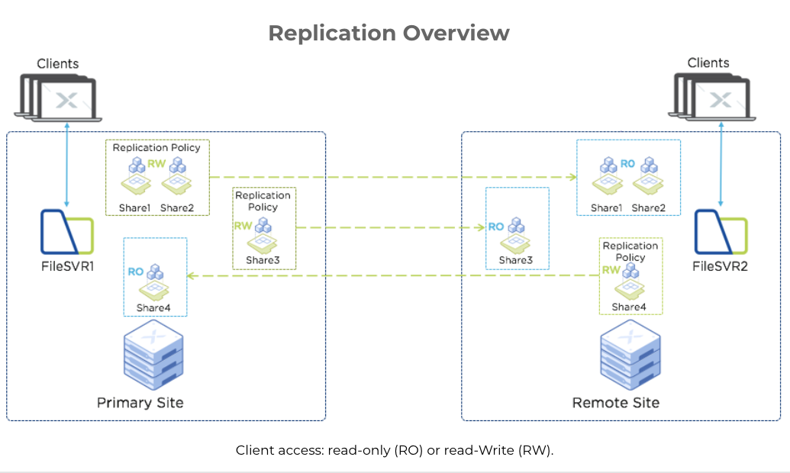
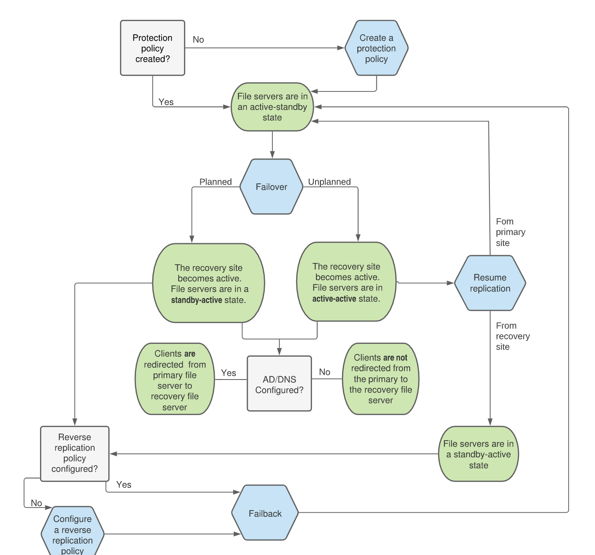
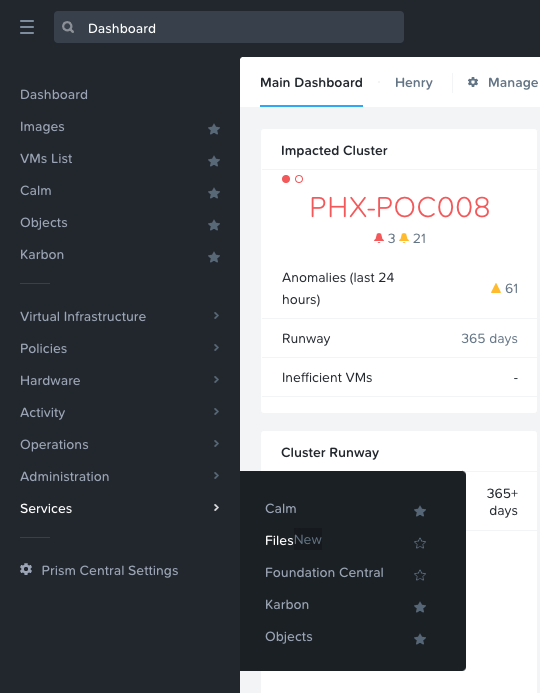

.. _files_replication:

.. title:: Smart DR:Files Replication

------------------------
Files: Smart DR
------------------------

.. note::

	The estimated time to complete this lab is 60 minutes

Overview
+++++++++

Smart disaster recovery (DR) is a data protection service for Nutanix Files.

Smart DR facilitates share-level data replication and file-server-level disaster recovery. In the event of a planned or unplanned loss of service, you can restore write access to protected shares by failing-over to a recovery site file server. Protection policies indicate failover details, including the primary location, recovery location, and the replication schedule. Rather than having a single protection policy for an entire file server, you can configure unique policies for different shares.

A short recovery time objective (RTO), helps ensure continuous availability of data once you fail over to a recovery site. Configuring Active Directory (AD) and domain name system (DNS) entries facilitates seamless client access redirection.

The following figure gives an overview implementation of Replication in Nutanix Files.

Typical Data Protection Setup for Smart DR
...........................................

The data protection process consists of the following procedures:

- Configuring a Files Protection Policy to replicate share data to a recovery site
- Configuring AD and DNS access for seamless client failover (if AD is different)
- Configuring a reverse replication policy
- Performing a planned or unplanned failover to DR site
- Failing back to the primary site

The following flowchart illustrates the decision making process for a share replication (Smart DR) setup.

Lab Setup
..........

In this lab we will configure replication between of shares between two Files servers on the same HPOC cluster.

Since we are doing this lab on a single HPOC cluster, we will have a single AD domain.

We will do the following:

1. Create a PROD Files server *intials*-fs-prod (1-VM Files Server)
2. Create a DR Files server *intials*-fs-dr (1-VM Files Server)
3. Create a SMB Files share in your PROD Files server and populate the share with sample files
4. Configure Files Protection Policy in Prism Central's :ref:`files_manager` and replicate
5. Failover, create new files in share and reverse-replicate
6. Failback and check contents

Files version include new feature updates. At the time of writing this labs these were the required versions of the following software components:

.. list-table::
  :widths: 25 75
  :header-rows: 1

  * - Software
    - Version
  * - AOS
    - 5.19.0.5
  * - Prism Central
    - pc.2021.3.0.1
  * - Files
    - 3.8.0.1
  * - Files Manager
    - 2.0.0 (upgraded through LCM)

Click here  for instructions to enable and update :ref:`files_manager` 

Create PROD Files Server
..........................

#. In **Prism > File Server**, click **+ File Server** to open the **New File Server Pre-Check** dialogue.

#. Click **Continue** on *New File Server: Pre-check* window (if it appeares)

#. Fill out the following fields:

   - **Name** - *intials*-fs-prod (e.g. XYZ-fs-prod)
   - **Domain** - ntnxlab.local
   - **File Server Size** - 1 TiB

#. Click on **Customize**

   .. figure:: images/customize.png

#. Click **Configure manually**

   .. figure:: images/configure_manually.png

#. Drop-down the **NUMBER OF FILE SERVER VMS** to **1**

   .. figure:: images/no_file_server.png

#. Click on **Save**

#. Select the **Primary - Managed** VLAN for the **Client Network**.

#. Click **Next**.

#. Select the **Primary - Managed** VLAN for the **Storage Network**.

   .. note::

   	Ideally, two different networks should be selected for Client and Storage network in production environments. But since this is a lab, we will be only using one network.

#. Click **Next**.

#. Fill out the following fields:

   - Select **Use SMB Protocol**
   - **Username** - Administrator@ntnxlab.local
   - **Password** - nutanix/4u
   - Select **Make this user a File Server admin**

   .. figure:: images/createfs_directory_svcs.png

#. Click **Next**.

   By default, Files will automatically create a Protection Domain to take daily snapshots of the Files cluster and retain the previous 2 snapshots. After deployment, the snapshot schedule can be modified and remote replication sites can be defined.

   .. figure:: images/createfs_confirm.png

#. Click **Create** to begin the Files deployment.

#. Monitor deployment progress in **Prism > Tasks**.

   Deployment should take approximately 10 minutes.

   .. figure:: images/createfs_progress.png

Create DR Files Server
..........................

#. Repeat steps 1 - 15 in the previous section to create DR Files Server with the following details:

#. Fill out the following fields(make sure to manually configure Files server to 1 VM):

	- **Name** - *intials*-fs-dr (e.g. XYZ-fs-dr)
	- **Domain** - ntnxlab.local
	- **File Server Size** - 1 TiB

#. Now you should have two Files Servers showing in Prism Element **Prism > File Server**

   .. figure:: images/createfs_twofs.png

Create a SMB Files Share in your PROD Files Server
....................................................

In this section we will create a source files shares to serve as a source and then we will replicate this share subsequently.

#. Click on your Prod Files Server *intials*-fs-prod (e.g. XYZ-fs-prod)

#. Click on **+ Share/Export**

#. Fill in the following details:

   - **Name** - *intials*-prod-share （e.g. XYZ-prod-share）
   - **Select Protocol** - SMB
   
   .. figure:: images/createshare_smb.png

#. Click on **Next**

#. In **Settings** section, select the following:

	- Enable Self Service Restore
	- Enable File System Compression
	- Enable Access Based Enumeration (ABE)
   
   .. figure:: images/createshare_settings.png

#. Click **Next**

#. Confirm your share settings and click on **Create**

   .. figure:: images/createshare_confirm.png

#. Login to your Windows Tools VM with the following credentials

	- **Username** - administrator@ntnxlab.local
	- **Password** - nutanix/4u

#. Browse to the location of your PROD (Source) share (e.g. ``\\xyz-files-prod.ntnxlab.local\xyz-prod-share``)

	.. note::

	 	You can find your PROD share location by selecting the Files Share in Prism Element and checking Share/Export details.

#. Download the following `Sample Zip File <http://10.42.194.11/workshop_staging/peer/SampleData_Small.zip>`_ and unzip it in your PROD share

   .. figure:: images/createshare_explorer.png

Configure Files Protection Policy in Prism Central and Replicate
...................................................................

Smart DR feature for Files share replication is activated and maintained in Prism Central using Files Manager. In this section we will configure Smart DR requirements in Prism Central.

The Files Manager lets you view and control all of your file servers from a single control plane. Clicking a file server directs you to Nutanix Files in Prism Element (PE) where you can manage the shares, exports, and configurations of the file server. File server alerts for all registered file servers appear in a single pane for consolidated viewing, as do file server events.

The Files Manager provides the Smart DR service for Nutanix Files, which lets you protect file servers at the share-level.

#. Logon to Prism Central

#. Click on :fa:`bars` > Services > Files

.. note::

If Files Manager is not enabledin your Prism Central, you will need to Enable Files manager by reading the information on enabling the Files Manager and clicking **Enable Files**

#. In Files Manager, click on **Data Protection > Polices > + New Policy**

#. Select your *intials*-fs-prod (e.g. XYZ-fs-prod) as the **Primary Location (Source File Server)**

   .. note::

   	Selecting the source Files server will automaticall select all the shares within this files server to be protected

#. Select your *intials*-fs-dr (e.g. XYZ-fs-dr) as the **Recovery Location (Target File Server)**

#. Select the **Recovery Point Objective (RPO)** as **10** minutes. (this is the lowest you can set as of now)

   .. note::

		 You can ignore the following warning as the this is just a test for Smart DR feature. In a customer environment the source and Target Files servers will be in different AOS clusters.

		 **xyz-files-dr is on the same AOS cluster as the source. It is recommended to have target file servers on a different AOS cluster.**

#. Make sure your selection looks as follows:

   .. figure:: images/smartdr_policysetup.png

#. Click on **Next** at the bottom of the screen

#. Fill in the following details in **Settings** section:

	- **Name** - *intials*-files-repl-policy (e.g. xyz-files-repl-policy)
	- **Description** - Protection Policy for XYZ Prod to DR Replication (Optional)

#. Click on **Create**

#. Monitor the Events and the policy should show in the **Data Protection > Polices > + New Policy** in a few minutes

   .. figure:: images/smartdr_policyrpo.png

	.. note::

	 	Wait a few minutes until all the files are replicated and **RPO Compliant** will have a green-dot to indicate intial synchronization

#. Go to **Data Protection > Replication Jobs** and observe the replication jobs and duration. The intial replication will take time based on the amount of data and network speeds. But the subsequent replications will be based on incremental changes only.

   .. figure:: images/smartdr_repjobs.png

#. Go to **Data Protection > Protected File Servers** to check the Active and Standby File servers. (Active indicated by a green A)

	.. figure:: images/smartdr_activefs.png

#. Now return to **Prism Element > Files > Shares/Export** and verify that a replicated share shows in the list

	.. figure:: images/smartdr_repshare.png

#. Select the replicated share and observe the **Mount Path** in the properties

   .. figure:: images/smartdr_rep_mountpath.png

#. Verify it shows the DR Files Server with the source PROD share (e.g. ``\\xyz-files-dr.ntnxlab.local\xyz-prod-share``)

Failover Share
...............

We have set up replication of a share between two Files servers. Now we are able to test failover of the share to the DR File server.

There are two failover methods:

- Planned Failover - allows a reverse-replication to the source File Server
- Unplanned Failover - no reverse-replication (as an admin doesn't know when the primary site will be operational again)

Both these methods are manually triggered by an administrator.

In this lab we will test a Planned Failover

#. Go to **Prism Central > Services > Files** (if you are note already on that page)

#. Go to **Data Protection > Protected File Servers**

#. Click on **Failover** as shown here

   .. figure:: images/smartdr_failover.png

#. Select **Planned Failover**

#. Select **Create a Reverse-Replication Policy** and fill in the following

   - **Recovery Point Objective (RPO)** - 10 minutes
	- **Policy Name** - Reverse-*initials*-files-repl-policy (e.g. Reverse-xyz-files-repl-policy)

   .. figure:: images/failover_settings.png

#. Click **Next**

#. In the **Active Directory and DNS Configuration** fill the following (to ensure access to files after failover)

   - **Username** - administrator@ntnxlab.local
   - **Password** - nutanix/4u
   - **Preferred Domain Controller** - ntnxlab.local
   - **Preferred Name Server** - 10.X.X.41 (Your AD IP address)

#. Select the **Use the same credentials as the Active Directory** check-box (in our lab both the AD and DNS server are the same)

#. Click on **Failover**

#. Monitor the Events in Prism Central

#. Once Faiover is completed, return to **Files > Data Protection > Protected File Servers** in Prism Central and check the Active and Standby File servers. (Active indicated by a green A)

#. Confirm that *initials*-files-dr (e.g. xyz-files-dr) server is now the active server

   .. figure:: images/failover_confirm.png

#. Return to your Windows Tools VM and access the failed over share in Windows Explorer

#. Login to your Windows Tools VM with the following credentials

   - **Username** - administrator@ntnxlab.local
   - **Password** - nutanix/4u

#. Browse to the location of your source share now hosted on DR Files server (e.g. ``\\xyz-files-dr.ntnxlab.local\xyz-prod-share``)

   .. figure:: images/failover_repshare.png

#. Go to **Data Protection > Replication Jobs** and verify that the source Files server is now *intials*-files-dr (e.g. xyz-files-dr) server

   .. figure:: images/failover_repjobs.png

#. Go to **Data Protection > Policies** and verify a reverse replication policy is present

   .. figure:: images/failover_reppolicy.png

#. The replication is now setup successfully

#. Create some sample files in your share as shown here so Failback can be tested

   .. figure:: images/failback_samplefiles.png

#. Wait for at least 10 minutes for the reverse replication schedule to start

#. Confirm at least one reverse replication schedule to PROD Files server has successfully completed by going **Data Protection > Replication Jobs**

Failback Share
...............

In this section we will see how to failback a share to the Source site after the environment is recovered.

In this lab we will test a Planned Failover

#. Go to **Prism Central > Services > Files** (if you are note already on that page)

#. Go to **Data Protection > Protected File Servers**

#. Click on **Failback** as shown here

   .. figure:: images/failback_initial.png

#. In the **Active Directory and DNS Configuration** fill the following (to ensure access to files after failover)

   - **Username** - administrator@ntnxlab.local
   - **Password** - nutanix/4u
   - **Preferred Domain Controller** - ntnxlab.local
   - **Preferred Name Server** - 10.X.X.41 (Your AD IP address)

#. Select the **Use the same credentials as the Active Directory** check-box (in our lab both the AD and DNS server are the same)

#. Click on **Next**

#. Files now gives you a visual of the failed-back environment and informs you that the Reverse Replciation policy will be delted

   .. figure:: images/failback_confirm.png

#. Click on **Failback**

#. Monitor the Events in Prism Central

#. Once the failover is done, go to your Windows Tools VM and logon to the share hosted on PROD files server (e.g ``\\xyz-files-prod\XYZ-prod-share\SampleData_Small\Sample Data`` )

#. Note that the new files that were created when the share was on DR server are now present on the PROD server as well

   .. figure:: images/failback_confirm_files.png

#. We have successfully failed back the share to the PROD site. Now users can connect to the share as usual.

Conclusion
...........

Nutanix Files Smart DR makes it easy for administrators to configure replication of shares between Nutanix Files servers without needing third-party integrations.

For information about Files Manager and Smart DR features, refer to this documentation `URL. <https://portal.nutanix.com/page/documents/details?targetId=Files-Manager-v2_0:fil-fm-dr-c.html>`_
