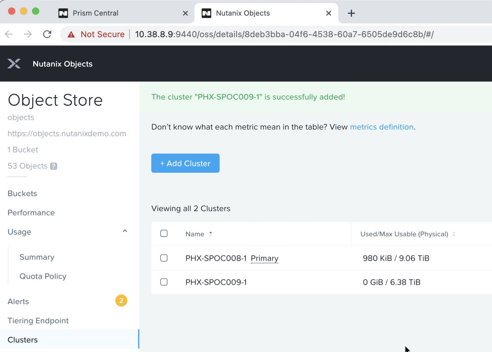

.. _objects_multi_cluster:

------------------------------
Objects: Multi-Cluster
------------------------------

*The estimated time to complete this lab is 10 minutes.*

Overview
++++++++

Data Storage can be expensive and often object stores can scale to very large deployments well into the PetaBytes. Customers need the ability to deploy large scale clusters that can scale across multiple AOS clusters. Nutanix Objects enables customers to do that using the Multi-Cluster feature.

Objects Multi-Cluster
+++++++++++++++++++++

Nutanix Objects Multi-Cluster is able to scale across any AHV or vSphere cluster that meets the following criteria:

- Joined to the same Prism Central as primary Objects cluster
- Has remain storage capacity
- Is running AOS 5.11.2+
- Located in same datacenter as primary cluster

**Note: Multi-Cluster is not suitable for cross-WAN communication.**

Lab Setup
++++++++++

**In this lab, you will walk through a Nutanix Objects Multi-Cluster feature.**

At high level we will implement the following:

- An Objects instance that utilizes the storage of two AOS clusters

**Google Chrome is required for this lab.**

Setup Objects Multi-Cluster
................................................................

In the following section you will see how easily you can add additional storage capacity from other Nutanix AOS clusters into your Nutanix Objects deployment.

#. In Prism Central, select :fa:`bars` **> Services > Objects**

   .. figure:: images/mc-00.png

#. Choose your Objects Store

   .. figure:: images/mc-01.png

#. Click on **Clusters**

   .. figure:: images/mc-02.png

#. Choose **Add Cluster**

   .. figure:: images/mc-03.png

#. Select your secondary cluster

   .. note::

   	Only compatible clusters will appear in this window. Nutanix Objects will only use storage on secondary cluster, no additional compute resources are required.

   .. figure:: images/mc-04.png

#. Configure storage limitations for Nutanix Objects on secondary cluster and click **Done**

   .. note::

      Storage will be utilized in a round-robin fashion across all of the clusters registered to Objects Multi-Cluster. Once a cluster nears it's storage hard limit, it will be placed into a secondary pool, receiving no further writes until all clusters registered are placed in that secondary pool. This ensures no cluster runs out of storage.

   .. figure:: images/mc-05.png

#. View Clusters Listed in **Clusters** pane

   .. note::

      Secondary cluster storage will be made available within just a couple of minutes after adding it to Multi-Cluster

   .. figure:: images/mc-06.png

Takeaways
++++++++++

What are the key things you should know about **Nutanix Objects Multi-Cluster**?

- Nutanix Objects allows easy configuration for adding additional AOS clusters to your object store deployment
- Intelligent distribution of data allows storage to be properly utilized across clusters of disparate sizes
- Multi-Cluster allows customers to reclaim "land-locked" storage in clusters that have spare capacity
